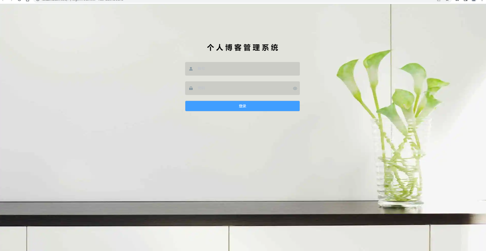
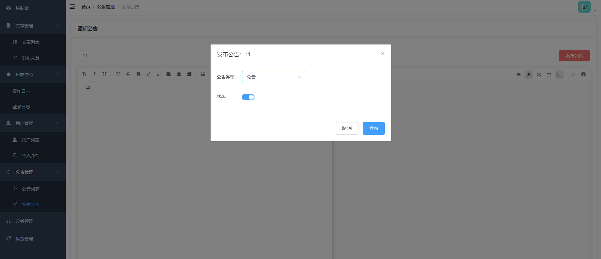

# 个人博客管理系统


## 1、详细教程

**后端代码地址**：[https://gitee.com/whxyh/personal_blog](https://gitee.com/whxyh/personal_blog)

**如何获得本教程：**

我在微信公众号上发布了个人博客系统的全部开发教程，关注下方微信公众号，找到下方的项目教程即可。


**还可以通过CSDN上去查看本教程：[Spring Boot + vue-element 开发个人博客项目实战教程](https://blog.csdn.net/m0_37779600/article/details/120937543)**


## 2、使用说明

### 2.1、初始化

```vue
npm install
```

### 2.2、启动

```vue
npm run dev
```

### 2.3、打包

```bash
npm run build
```


### 2.4、运行地址

[http://localhost:9528](http://localhost:9528)


**初始密码为：admin/123456**

## 5、项目展示

**登录页面**：







